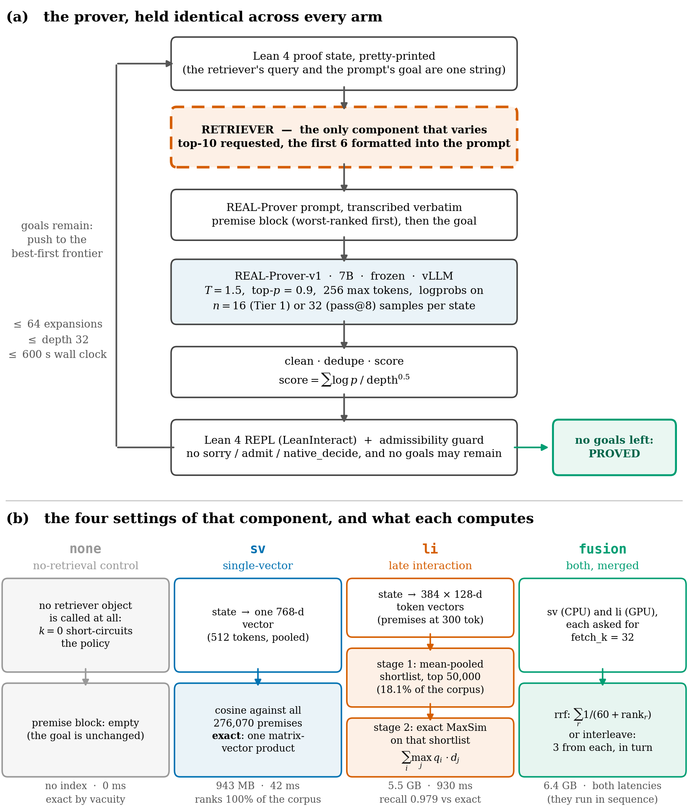
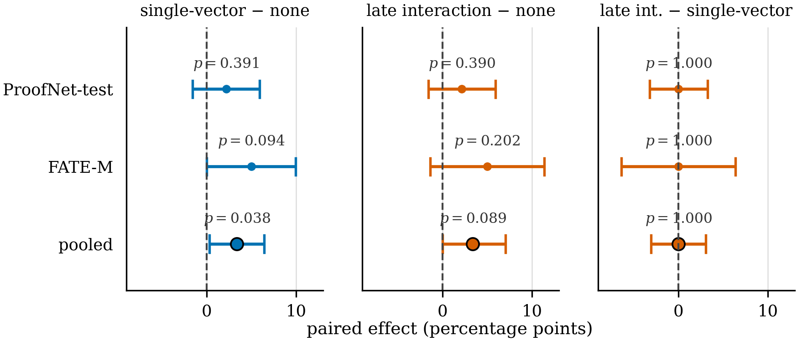
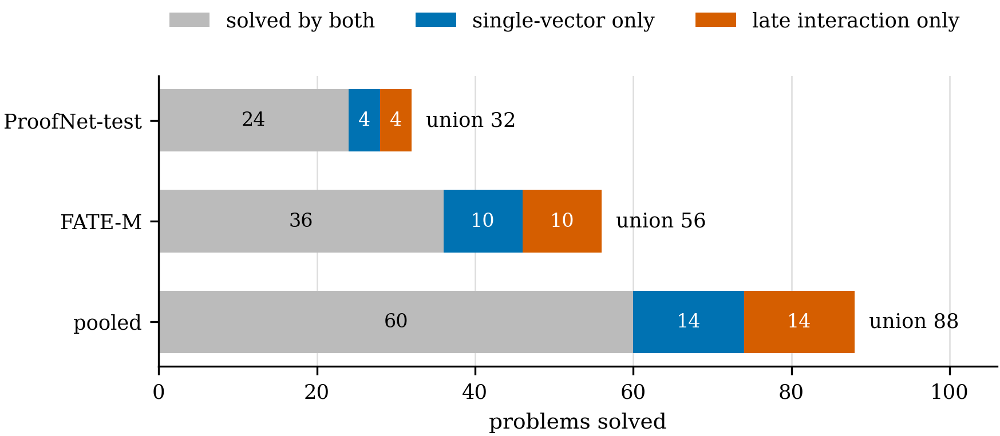
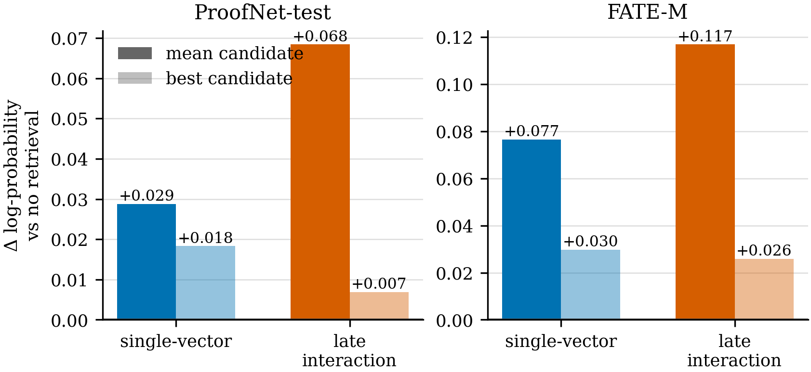
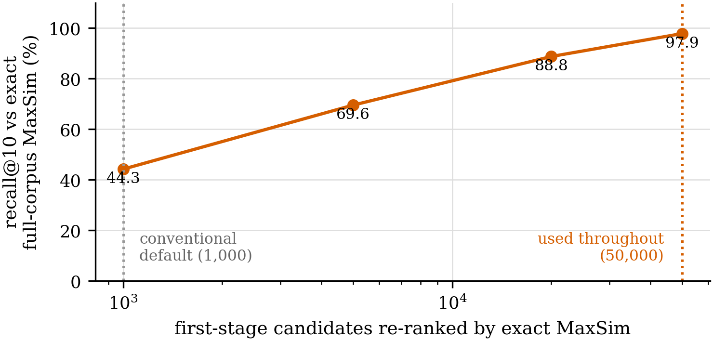
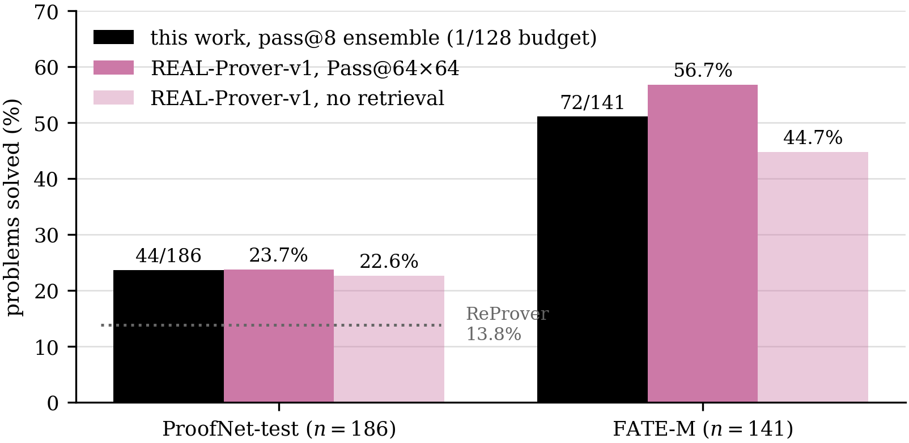
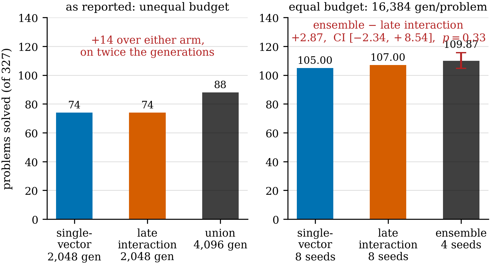

# ProofLens-Prover — does multi-vector retrieval help a Lean 4 theorem prover?

**MSc dissertation project, University of Manchester.** A controlled, end-to-end comparison of
**token-level multi-vector (late-interaction) retrieval** against **matched single-vector retrieval**
inside a live Lean 4 proof search — with a no-retrieval control, on 327 theorems, two benchmarks, and
two independent tactic generators.

> **The research question.** Retrieval quality for premise selection is normally measured offline, in
> Recall@k against a gold premise list, and improvements there are *assumed* to transfer to proving.
> This project holds everything except the retriever byte-identically fixed and measures the only
> quantity a user of a prover cares about: **theorems closed**.

The retrievers are inherited unchanged from a completed premise-selection study (**ProofLens**),
which established with a matched control over five training seeds that late interaction is *causally*
more robust to premises absent from its training data — and that the advantage did not transfer to a
fixed generator's next-tactic accuracy. Its final open item was that there was no live prover. This
repository is that missing experiment.

---

## Headline

**1. The retrieval architecture does not decide anything at this scale.**

| | late interaction | single-vector | | |
|---|--:|--:|---|---|
| Tier 1, one seed (327 problems) | **74** | **74** | 14 gained / 14 lost | **p = 1.0000** |
| pass@8, 16× the budget (327) | 107 | 105 | 11 / 9 | p = 0.8238, CI [−2.14, +3.36] pts |
| ProofNet-test alone | 39 | 39 | 5 / 5 | **p = 1.0000** — an exact tie, twice |

The null survives a 16× budget increase, eight independent draws, two generators, two Lean
environments, and a fused retriever built specifically to break it.

**2. Retrieval itself helps — less than the literature's framing suggests, and only conditionally.**

| contrast, pooled over 327 | Δ | gained / lost | p | |
|---|--:|---|--:|---|
| single-vector vs no retrieval | **+11** | 18 / 7 | **0.038** | **significant** |
| late interaction vs no retrieval | **+11** | 23 / 12 | 0.089 | not significant |

Same net effect, different route: late interaction *displaces* nearly twice as many proofs the
control already had, and a paired test reads the discordant pairs rather than the net. On competition
arithmetic (miniF2F, 244 problems) the whole effect is **+1**.

**3. An ensemble of both retrievers matches the published state of the art at 1/128 of its budget.**

| | this work (pass@8 ensemble) | REAL-Prover-v1 (Pass@64×64) | ReProver |
|---|--:|--:|--:|
| **ProofNet-test** | **44 / 186 = 23.7%** | 23.7% | 13.8% |
| **FATE-M** | **72 / 141 = 51.1%** | 56.7% | — |
| generations per problem | **32,768** | 4,194,304 | — |

On ProofNet that *matches* the published figure to the precision it is reported at (23.7% of 186 is
44.08 problems; the ensemble solves 44). It does not beat it — a strict win needs 45.

**4. But that ensemble's advantage is budget, not architecture.** Priced at equal generations, two
retrievers beat the better single retriever by **+2.87 of 327, CI [−2.34, +8.54], p = 0.33** — about
a fifth of what the raw union advertises, and not significant.

**5. It is a null under stated conditions, not a proof of equivalence.** Late interaction was measured
in the only form the available compute permitted, and four measured constraints all point against it:
it is the **only arm that cannot rank the corpus exactly** (0.979 of its own true top-10 against
single-vector's 1.000), its generator was fine-tuned on a **single-vector** retriever's output, its
prompts truncate 4–5× more often, and the wall clock cuts it off twice as often at 32 samples. None
can manufacture a null — a bias against the treatment arm cannot produce an advantage it never had —
but together they mean the question is **measured rather than settled**. See
[Limitations](#limitations-and-what-is-not-settled).

---

## The system



*(a) the prover loop, byte-identical in every arm. (b) the four things the one varying component is
ever set to. Every constant on this figure is imported from the module it documents by
`scripts/make_figures.py`, not typed, so the diagram cannot drift from the code.*

### The arms

| arm | what it is | why it exists |
|---|---|---|
| **`none`** | **the floor.** No retriever object is called at all — `top_k = 0` short-circuits the policy, `n_queries: 0`, no index loaded. | Every retrieval claim is measured *against* this. Without it, "84% of proofs cite a retrieved premise" is unfalsifiable. |
| **`sv`** | **ProofLens-SV** — one 768-d vector per premise; ranks all 276,070 **exactly**, one matrix–vector product. 943 MB, 39–42 ms/query. | the **matched control**: same encoder class, same training triplets, same corpus. The only difference is the architecture. |
| **`li`** | **ProofLens-LI** — late interaction, one vector per *token*: 21,752,080 vectors, 128-d. Two-stage: mean-pooled shortlist of 50,000, then exact MaxSim. 5.5 GB, 930–1,015 ms/query. | the thing being tested |
| **`fusion`** | both, merged by reciprocal rank fusion (K = 60) or round-robin interleave, `fetch_k = 32` each | tests whether one retriever can capture what the pair reaches |
| **`bm25`** | lexical baseline, exact over the same corpus | cheapest possible retriever; model-free tier only |

`sv` is what makes this a controlled experiment rather than a demo. A retriever compared against BM25
or against nothing tells you retrieval helps; a retriever compared against a **matched single-vector
control** tells you whether *late interaction* helps.

### What is retrieved, and when

Not document RAG. The retrieved units are **Lean premises** — every theorem, lemma, definition and
instance in Mathlib v4.16.0, extracted from Lean's **elaborated environment** rather than by parsing
source (macro-generated declarations such as `to_additive` are invisible to a regex and account for
thousands of citable lemmas).

| | |
|---|--:|
| premise corpus | **276,070** declarations, Mathlib v4.16.0 |
| corpus fingerprint | `276070:31db61c63a9b7ee1` — asserted at every index build and every run, so all arms rank the identical set |
| query | the theorem statement at the root; the pretty-printed goal at every state thereafter |
| retrieved per query | top **10**, of which **6** fit the prompt budget |
| when | **at every proof state** — 3,874–5,631 queries per benchmark run |
| generator | **REAL-Prover-v1** (7B, `Qwen2.5-Math-7B` base), **frozen**; prompt transcribed verbatim |
| search | best-first, `score = Σ log p / depth^0.5`; 64 expansions × 16 samples (Tier 1) or × 32 (sweep), depth 32, 600 s, T = 1.5 |

A second tier, **Track A′**, replaces the language model with **no model at all** — 19 fixed Lean
tactics plus 5 premise templates (`exact {p}`, `apply {p}`, `rw [{p}]`, `rw [← {p}]`, `simp [{p}]`).
It has no prompt sensitivity, no sampling variance and no training confound, so any difference between
arms there is the retriever alone.

---

## Results

### Tier 1 — frozen REAL-Prover-v1 (7B), one seed



| benchmark | none | single-vector | late interaction | Δ SV | Δ LI | Δ LI−SV |
|---|--:|--:|--:|--:|--:|--:|
| FATE-M (141) | 39 (27.7%) | **46 (32.6%)** | **46 (32.6%)** | +7 (p = 0.094) | +7 (p = 0.202) | +0 (p = 1.000) |
| ProofNet-test (186) | 24 (12.9%) | **28 (15.1%)** | **28 (15.1%)** | +4 (p = 0.391) | +4 (p = 0.390) | +0 (p = 1.000) |
| **pooled (327)** | **63** | **74** | **74** | **+11 (p = 0.038)** ✅ | +11 (p = 0.089) | **+0 (p = 1.000)** |

*Every p in this document is the **sign-flip permutation** test. A result is called significant only
when the 95% paired bootstrap interval excludes zero **and** that permutation test gives p < 0.05;
where the two disagree, neither is reported. `results/tables/table1.md` prints exact McNemar
alongside, which is close but not identical — quoting the two interchangeably is an easy mistake and
`scripts/check_readme.py` pins the permutation values to prevent it.*

**Calibration.** ReProver — sub-1B, single-vector, stepwise, one pass — reports **13.8%** on ProofNet;
this harness reports **15.1%**. Evidence the rig is in the right regime, not a comparison of systems.

**The tie is not one run counted twice.** Proof text is only **16.7% / 37.5%** identical between the
arms (a duplicate gives ~100%); **20 and 8** problems are discordant; latency differs **24×**; and
re-running one arm at fixed code and environment is **byte-identical** — 46 against 46, discordance 0.

### Equal counts, different theorems



Each retriever solves 74 of 327, but **28 problems are solved by exactly one of them**, so the union
reaches **88 (+14)** — larger than retrieval's entire measured effect. That gap is what the ensemble
below cashes in. It is also the number [corrected at equal budget](#the-budget-matched-correction).

### Why they tie — the mechanism



At **depth 0** every arm is prompted with the identical statement and differs only in the attached
premises — the one properly paired measurement available. Change in log-probability of sampled
tactics, against the no-retrieval control:

| contrast | FATE-M mean | FATE-M best | ProofNet mean | ProofNet best |
|---|--:|--:|--:|--:|
| SV vs none | +0.1023 ✅ | +0.0297 ✅ | +0.0289 | +0.0182 ✅ |
| LI vs none | **+0.1265** ✅ | +0.0258 ✅ | **+0.0905** ✅ | +0.0069 |
| LI vs SV | +0.0242 | **−0.0039** | +0.0616 | **−0.0113** |

**Retrieval genuinely improves the generator — but late interaction improves the *mean* candidate
4.9× and 13.1× more than it improves the *best* one, and best-first search consumes only the best.**
Between the two architectures the top candidate is not better at all; it is *negative* on both
benchmarks. There is no channel through which the advantage could become a proof.

Three further tests point the same way:

* **No population cancellation.** Novel-premise enrichment among late interaction's exclusive wins is
  +0.0139, p = 0.8542. The real reason is that only **~43%** of the premises these proofs cite are
  unseen by the retriever, against a **78.2%** corpus base rate — a **2.7× concentration** toward the
  training distribution. **The benchmarks barely exercise the regime late interaction wins in.**
* **The null gets stronger at 16× the budget**, not weaker — the design's own prediction was the
  opposite.
* **Fusion cannot capture the union** (below).

### The two-stage approximation — a methodological result



Late interaction cannot rank a large corpus exactly: exact MaxSim for a 384-token query against 21.7M
token vectors is ≈33 GB of arithmetic **per query**, ~5,300 times per run. **Every deployed
late-interaction system is therefore two-stage, whether or not it says so**, and the first stage's
recall is a property of the deployment rather than of the architecture.

| `n_candidates` | % of corpus | recall@10 vs exact | queries lossless |
|--:|--:|--:|--:|
| **1,000** (conventional default) | 0.36% | **0.443** | 9 / 141 |
| 20,000 | 7.24% | 0.888 | 81 / 141 |
| **50,000** (used throughout) | 18.11% | **0.979** | 124 / 141 |

The `recall@10 = 0.992` printed at index-build time was measured with **premise embeddings as probes**
— a premise retrieving its neighbours, not a proof state retrieving a premise. Wrong distribution;
**a 2.2× overstatement**. Correcting it is worth **+9 problems on FATE-M and +8 on ProofNet** with
nothing else changed, and it turned an apparent significant *loss* for late interaction into a null.

> **A late-interaction result that does not state its first-stage recall on the real query
> distribution is not interpretable.** Two thirds of an apparent architecture effect here was the
> approximation, not the architecture.

### Scaling to pass@8



Eight independent seeds per arm, 32 samples per expansion, 25% of each expansion sampled without
premises — 32 runs, ~124 GPU-hours. Reported as a **deployable ensemble**: run both arms at every seed
and accept any proof any run finds. Nothing needs to know in advance which arm wins, which is what
makes it a system rather than an oracle. pass@k uses the unbiased estimator
`1 − C(K−c,k)/C(K,k)` over **seed** subsets (Chen et al. 2021), not the union of whichever k runs came
first.

| | single draw | **pass@8 ensemble** | gain |
|---|--:|--:|--:|
| ProofNet-test | 32 / 186 (17.2%) | **44 / 186 (23.7%)** | +12 |
| FATE-M | 56 / 141 (39.7%) | **72 / 141 (51.1%)** | +16 |
| pooled | 88 / 327 (26.9%) | **116 / 327 (35.5%)** | **+28** |

The ensemble leads at **every** k including k = 1, and neither arm's FATE-M curve has flattened by
k = 8 — so 23.7% is a budget ceiling, not a limit of the method.

**A self-correction.** The most striking finding of the single-draw failure profile — that
single-vector dies early and silent while late interaction always exhausts the expansion budget — was
a consequence of **16 samples per expansion, not of retrieval architecture**. Doubling samples cut
`no_candidates` on ProofNet from 42% of attempts to 19.5% and erased the asymmetry entirely. A
failure-mode claim about a proof search must state the sample budget it was measured at.

### Fusion, and the budget-matched correction

Reciprocal-rank fusion was run under a **stop rule fixed before the data existed** (≥69 continue /
65–68 borderline / ≤64 stop). It returned the bottom branch and the rule was honoured.

| FATE-M, pass@4, 8,192 generations/problem | proved |
|---|--:|
| late interaction | **64** |
| single-vector | 62 |
| **fusion (RRF)** | **64** — identical, for 18% more wall clock |
| fusion (interleave, 3 from each arm guaranteed) | **64** — identical again |

Fusion changes which premises reach the six prompt slots and changes **nothing** about the failure
profile. Two merge rules — one maximising consensus, one built specifically to guarantee that
late-interaction-only premises survive — score the same. **If premise availability were the binding
constraint, those two rules could not tie.** What a second arm buys is a second *search trajectory*,
which no ranking rule can supply.

#### The budget-matched correction



The +14 union above compares **two** retrievers at one seed against **one** retriever at one seed —
twice the generations on one side. That is not a paired comparison. At equal budget (16,384
generations per problem):

| | expected problems solved, of 327 |
|---|--:|
| single-vector @8 seeds | 105.00 |
| late interaction @8 seeds | 107.00 |
| **ensemble @4 seeds** (both arms, same budget) | **109.87** |

**ensemble − late interaction = +2.87, CI [−2.34, +8.54], p = 0.3251 — not significant.** The raw
union inflates the value of retrieval diversity by roughly **5×**.

> **Report retrieval ensembles at equal generation budget or not at all.** This is the discipline the
> pass@k literature already applies to *sampling* budgets, extended to the ensemble axis.

### Track A′ — the model-free replication

No generator in the loop, so any difference is the retriever alone.

| benchmark | none | SV | LI | Δ SV | Δ LI | Δ LI−SV |
|---|--:|--:|--:|--:|--:|--:|
| **FATE-M** (141) | 12 (8.5%) | **35 (24.8%)** | 31 (22.0%) | **+23** (p = 0.0001) ✅ | **+19** (p = 0.0002) ✅ | −4 (p = 0.34) |
| **ProofNet-test** (186) | 9 (4.8%) | **20 (10.8%)** | **20 (10.8%)** | **+11** (p = 0.0011) ✅ | **+11** (p = 0.0011) ✅ | +0 (p = 1.00) |
| miniF2F-test (244) | 78 (32.0%) | 77 (31.6%) | 79 (32.4%) | −1 (p = 1.00) | +1 (p = 1.00) | +2 (p = 0.50) |

Two independent generators, chosen so their weaknesses do not overlap, **agree on both findings**:
retrieval helps, the architecture does not decide it. And **benchmark choice determines whether a
retrieval claim is measurable at all** — only **23%** of proofs found on miniF2F name a retrieved
premise, against 80–86% on the other two, because its problems fall to
`linarith`/`nlinarith`/`omega`/`norm_num`.

Track A′ also shows **zero displacement** on both premise-heavy benchmarks: a policy that can only
instantiate templates over retrieved premises has nothing to be talked out of. **Whether retrieval can
*cost* a proof is a property of the policy, not of retrieval.**

### Contamination, honestly bounded

The corpus is all of Mathlib and some benchmark theorems restate lemmas Mathlib already contains, so a
retriever can occasionally hand over the answer. `scripts/contamination_audit.py` counts solved
problems whose **entire proof is a single `exact`/`apply` naming a corpus premise** — the narrowest
definition, so it under-counts, which is the right direction for a bound.

**7 of the 41 problems retrieval won (17%) closed by a single corpus citation, all on FATE-M; on
ProofNet, none did.** It cannot manufacture an architecture difference — both arms index the identical
corpus, enforced at build time — and the control closes 3 and 2 the same way with no retriever
present.

---

## Conclusions

1. **Runtime premise retrieval measurably improves a live Lean prover**, but the effect is smaller and
   more fragile than a single run set suggested: +11 of 327 pooled, significant for single-vector
   (p = 0.038), not for late interaction (p = 0.089) — the difference being displacement, not gain.
2. **It holds only where proofs require citing lemmas the policy cannot otherwise reach.** On
   competition arithmetic the effect is one problem in 244.
3. **For the retrieval *architecture*, the answer is a null — and a null is not the same as an
   answer.** No difference was detectable under either generator, on either benchmark, at four
   separate budgets, at 5.8× the memory and 24× the latency. But see conclusion 8.
4. **The null has a measured mechanism, and that is the contribution.** Late interaction improves the
   **mean** sampled tactic far more than the **best** one, and best-first search consumes only the
   best. This is a general statement about *retrieval under argmax-style search*, not a fact about
   these checkpoints — any system whose selection rule reads only the best of n sampled continuations
   should expect retrieval gains concentrated in the mean to be invisible end to end.
5. **The tie is conditional, not general.** These benchmarks' proofs are 2.7× concentrated in the
   retriever's training distribution, so the regime late interaction wins in is barely exercised. The
   practical rule: **choose multi-vector retrieval when the premise distribution is genuinely novel
   relative to training — and standard Lean benchmarks are not that.**
6. **Any late-interaction result should state its first-stage recall on the real query distribution.**
   The plausible 0.992 available at index-build time overstates it by 2.2×, and correcting it was
   worth +9 and +8 problems.
7. **Report retrieval ensembles at equal generation budget or not at all.** The union statistic that
   motivated an entire phase of this work — +14 of 327, larger than retrieval's own effect — is
   **+2.87 and not significant** once the second arm's generations are paid for.
8. **The central question is measured, not settled, and that is where this leaves it.** Every
   constraint in conclusion 3's shadow — the approximation, the generator's training, truncation, the
   wall clock — is a consequence of the compute available rather than of the design, and every one is
   directional **against** multi-vector retrieval. Four experiments would close the gap; none was
   affordable here. **Until the first is run, every statement of the null carries the clause "for a
   generator trained on single-vector retrieval".**

### Two self-corrections carried in the record

| what was believed | what the data says |
|---|---|
| late interaction supplies recall, single-vector supplies ranking | a **sample-budget artefact**; the asymmetry vanishes at 32 samples |
| the union of two arms is worth +14 of 327 | at equal budget it is **+2.87, not significant** |

A third correction is in the infrastructure: a shared filesystem changed a reported number by **five
problems on one arm** before Lean was staged node-locally. **The execution environment is a
first-class experimental variable.**

---

## Limitations, and what is not settled

**The four directional constraints on late interaction** — all measured, all pointing the same way:

| constraint | magnitude | favours |
|---|---|---|
| **It cannot rank the corpus exactly.** Intrinsic at this corpus size, not a tuning shortfall. | 0.979 of its own true top-10; **17 of 141 queries still lossy** at the setting used | single-vector (exact 1.000) |
| **The generator was fine-tuned on a single-vector retriever's output** (`LeanSearch-PS`, 7B) | unquantified — no retriever-agnostic generator exists to compare against | single-vector |
| **Prompt truncation** at 3,840 tokens; late interaction's premise blocks are longer | 114 prompts against 68 — at worst 1 in 470 | single-vector |
| **The wall clock** at 600 s; late interaction's per-expansion cost is 1.7–1.9× | 18 searches cut short against 9, at 32 samples. At Tier 1 the budget binds **once in 981** problem-arms, and that once is the control | single-vector |

None can *produce* a null — a bias against the treatment arm cannot manufacture an advantage it never
had — and each is bounded near 1% of attempts. What they can do is **mask a small real advantage**,
and the residual uncertainty is concentrated in the first two rather than spread across all four.

**Other limits:**

* **Budget.** Even at pass@8 this is **1/128** of the published configuration, and neither arm's
  FATE-M coverage curve has flattened at k = 8.
* **Retriever scale.** Both arms are ~149M-parameter models; REAL-Prover's own retriever is 7B —
  roughly **47× larger**. A null between two small retrievers does not establish one between two large
  ones.
* **Fusion was tested on one benchmark at pass@4**, under a stop rule that made the second contingent
  on the first. ProofNet fusion is also not runnable as configured: with single-vector on the CPU the
  slowest projected seed is 7.99 h against an 8 h scheduler limit.
* **Proof serialisation loses ~0.19% of claims** — 3 in ~1,600, where a multi-line tactic (`let`,
  `calc`) swallows its successor when the step list is newline-joined. Identical across arms, so no
  contrast is affected, and the correction could only move counts **upward**.
* **Absolute rates are not comparable to published systems** without their budgets attached, which is
  why every table here carries one.

### Next steps, in value order

| # | experiment | cost | what it settles |
|---|---|---|---|
| 1 | **A retriever-agnostic generator** — one not fine-tuned on either retriever's output | high | the largest open threat to the null |
| 2 | **A benchmark whose proofs cite premises the retriever never saw** (e.g. Mathlib theorems added after the training snapshot) | benchmark construction, no training | whether the 2.7× concentration is the whole mechanism |
| 3 | **Close the approximation gap** — extend the recall curve past 50,000, then re-run at a larger shortlist or a compressed (ColBERTv2/PLAID) index | recall curve: no GPU; re-run: ~1.5–2× | whether the null survives late interaction near its exact form |
| 4 | **pass@16** | ~124 GPU-h, no rerun | whether 23.7% is a budget ceiling |

Deferred as poor value: LoRA-trained generators (reintroduces the training confound the frozen design
exists to avoid) and PutnamBench (cannot discriminate between retrievers at this scale).

---

## Reproducing

Python 3.11, ~40 GB disk, a GPU for index building (CPU works, ~28× slower).

```bash
git clone https://github.com/irohan0/prooflens-prover && cd prooflens-prover
uv venv --python 3.11 && uv pip install -e '.[retrieval]'
```

**Every number in this README is recomputable from `results/exported/` by a committed script** — no
figure or table is transcribed by hand. If you only want to check the analysis, skip to step 5.

**1. Lean + Mathlib** (once per machine)

```bash
scripts/setup_lean_project.sh ~/lean/mathlib_v4160 v4.16.0
python scripts/lean_smoke.py --project-dir ~/lean/mathlib_v4160   # gate: must pass first
```

**v4.16.0 is not arbitrary**: all 141 FATE-M and 244 miniF2F statements elaborate on it, against 138
and 212 on v4.31.0 — and a statement that fails to elaborate is silently scored as unproved.

**2. Premise corpus and indices**

```bash
scripts/extract_premises.sh ~/lean/mathlib_v4160 data/premises/mathlib_v4160.jsonl
python scripts/build_dense_index.py --kind li --checkpoint <li-checkpoint> \
    --corpus data/premises/mathlib_v4160.jsonl --out data/index/li_ft_novel_bm25 \
    --assert-corpus-id 276070:31db61c63a9b7ee1
python scripts/build_dense_index.py --kind sv --checkpoint <sv-checkpoint> \
    --corpus data/premises/mathlib_v4160.jsonl --out data/index/sv_ft_novel_lr3e6 \
    --assert-corpus-id 276070:31db61c63a9b7ee1
```

`--assert-corpus-id` is what makes the arms comparable: it fails the build unless every retriever ranks
the identical candidate set. Without it, a difference between arms could be a difference between
corpora.

**3. Run an arm**

```bash
# Track A' (model-free) — no GPU, no LLM
python scripts/prove_benchmark.py --benchmark fate_m --arm li \
    --index data/index/li_ft_novel_bm25 --data-root <REAL-Prover>/data \
    --lean-project ~/lean/mathlib_v4160 --samples-per-step 32 --min-closers 19 \
    --n-candidates 50000

# Tier 1 (frozen 7B). On a cluster, prefer the sbatch: it enforces node-local Lean staging.
BENCHMARK=fate_m ARM=li INDEX=data/index/li_ft_novel_bm25 \
    sbatch -p gpuA -A <account> -G 1 slurm/prove_benchmark_llm.sbatch
```

**4. The pass@8 sweep.** Eight seeds are **one array submission** — `SEED` comes from
`SLURM_ARRAY_TASK_ID`, and passing both is refused, because two runs sharing a seed is the same draw
counted twice and inflates every pass@k above it.

```bash
# Check the whole configuration WITHOUT a GPU first: index corpus id, benchmark count, model dir, a
# real propose() call, prompt budget, disk, and the projected wall clock against the SLURM limit.
python scripts/preflight_sweep.py --benchmark proofnet_test --arm li \
    --index data/index/li_ft_novel_bm25 --data-root <REAL-Prover>/data \
    --model <model-dir> --samples-per-step 32 --premise-free-fraction 0.25 --slurm-time 8

BENCHMARK=proofnet_test ARM=li INDEX=data/index/li_ft_novel_bm25 N_CANDIDATES=50000 \
    SAMPLES=32 PREMISE_FREE_FRACTION=0.25 \
    sbatch --array=0-7 -p gpuA -A <account> -G 1 slurm/prove_benchmark_llm.sbatch
```

Repeat for `ARM=sv INDEX=data/index/sv_ft_novel_lr3e6` (no `N_CANDIDATES` — single-vector has no first
stage, and passing one aborts the run) and for `BENCHMARK=fate_m`. Four submissions, 32 jobs,
~124 GPU-h.

**5. Verify, then analyse** — this works on the shipped records with no GPU and no Lean.

```bash
# Every claimed proof is re-elaborated from the benchmark statement in a fresh Lean environment,
# by code that shares nothing with the search but the cheat-token regex.
python scripts/verify_proofs.py --run results/exported/logs/<run_id> \
    --data-root <REAL-Prover>/data --lean-project ~/lean/mathlib_v4160

# The Tier 1 headline table. Both filters are load-bearing against the exported records: the
# pass@8 sweep and the 60-problem budget pilot are *newer* than the Tier 1 runs, so "most recent
# per (benchmark, arm)" would otherwise hand them the cells and print a plausible, wrong table.
# The script refuses either mistake rather than relying on you remembering the flags.
python scripts/build_table1.py --policy vllm --results-root results/exported/logs     --match search.samples_per_step=16 --full-benchmarks
python scripts/compare_arms.py --pooled                             # paired significance
python scripts/passk_union.py --results-root results/exported/logs \
    --match search.samples_per_step=32 \
    --match policy_config.premise_free_fraction=0.25                # coverage curves, pass@k
python scripts/budget_matched.py --results-root results/exported/logs \
    --match search.samples_per_step=32 \
    --match policy_config.premise_free_fraction=0.25                # the equal-budget control
python scripts/make_figures.py                                      # all 17 figures -> figures/
```

**The `--match` filters are load-bearing.** The budget pilot measured its configuration on ProofNet's
first 60 problems, so filtering on budget alone would drag a 60-problem subset into an eight-seed
estimate. `passk_union` refuses that as a duplicated seed — but the refusal is the only thing standing
between a subset run and the headline table.

**Four fusion runs ship without `verification.json`** (the export ran before verification finished on
the cluster), so `passk_union --arm fusion` needs `--allow-unverified`. Fusion's numbers are identical
either way: both rejected proofs are `calc` serialisation failures solved by other fusion seeds, so
the union is 64 with and without the discount.

**Tests:** `pytest` — 1,071 hermetic tests plus 10 live-Lean tests that skip unless
`PROOFLENS_LEAN_PROJECT` points at a pre-built Mathlib. `ruff check .` for lint.

### What the tooling refuses to do

Guardrails, because most of this project's corrections came from a plausible number that was wrong:

* an index build or a run whose **corpus fingerprint** differs from `276070:31db61c63a9b7ee1`;
* a pass@k estimate over **duplicated seeds**, mismatched configurations, or unverified runs;
* a **significance claim** where the bootstrap interval and the permutation test disagree;
* a proof containing `sorry` / `admit` / `sorryAx` / `native_decide` / `apply?`, or one leaving goals;
* a sweep submission whose **projected wall clock** exceeds the scheduler limit (`preflight_sweep.py`,
  no GPU required).

---

## Layout

```
src/prooflens_prover/
  lean/         backend protocol, LeanInteract backend, the single acceptance predicate
  retrieval/    base + NullRetriever, bm25, dense (SV + two-stage LI, MaxSim in numpy), rank fusion
  prover/       best-first search, model-free repertoire, vLLM policy, REAL-Prover's prompt
  data/         benchmark and premise-corpus loaders, corpus fingerprinting
  eval/         paired comparison, bootstrap + permutation, pass@k draws, verification discounting
  utils/        seeding, logging, run manifests, io
scripts/        extraction, index building, benchmarks, preflight, verification, analysis, figures
slurm/          cluster jobs (array submission, node-local Lean staging enforced)
tests/          1,071 hermetic + 10 live-Lean
results/exported/   79 run records — manifests, per-problem attempts, verification, tables
figures/        17 figures (300 dpi PNG), regenerated by scripts/make_figures.py
```

Every run writes a manifest — config, seed, git SHA (with a `-dirty` marker), package versions, Lean
version, hardware, SLURM job id — **before** doing any work, so a job killed by the scheduler still
leaves a record of what it attempted.

## Acknowledgements

Benchmarks, prompt, search configuration and reference numbers from
[REAL-Prover](https://github.com/frenzymath/REAL-Prover) (arXiv:2505.20613) and
[FATE](https://github.com/frenzymath/FATE). Lean interaction via
[LeanInteract](https://github.com/augustepoiroux/LeanInteract). pass@k estimator from Chen et al.,
*Evaluating Large Language Models Trained on Code*, §2.1. Retriever checkpoints from the predecessor
ProofLens premise-selection study.

Supervised by Dr. Mehran Hosseini, University of Manchester.
